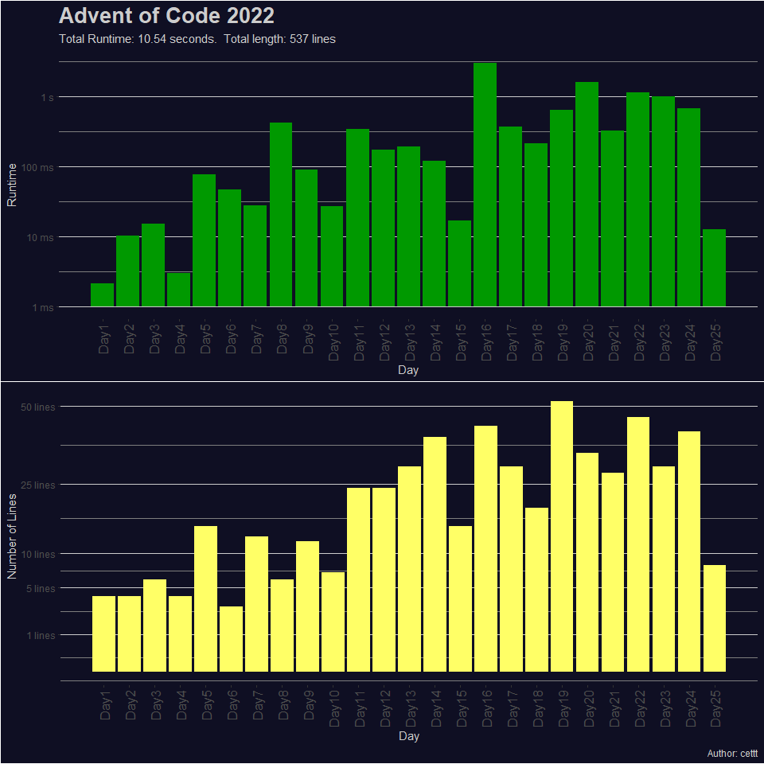

<a href = 'https://adventofcode.com/2022'> Advent of Code 2022 </a>
================

# Summary

Advent of Code is annual event which consits of daily programming
puzzles. The event is hosted by [Eric Wastl](http://was.tl/) and takes
place between December 1st and December 25th.

I solved all puzzles using R (version 4.2.2). Most of the solutions only
require base packages. For Day 12 I used the
[collections](https://cran.r-project.org/web/packages/collections/index.html)
library which provides high performance container types (in particular
priority queues).

Some solutions are still not optimal, especially Days 19, 23 (long run
time), and

I try to go for fast and short solutions which means that the resulting
code is not always as easy to read as it could be.

